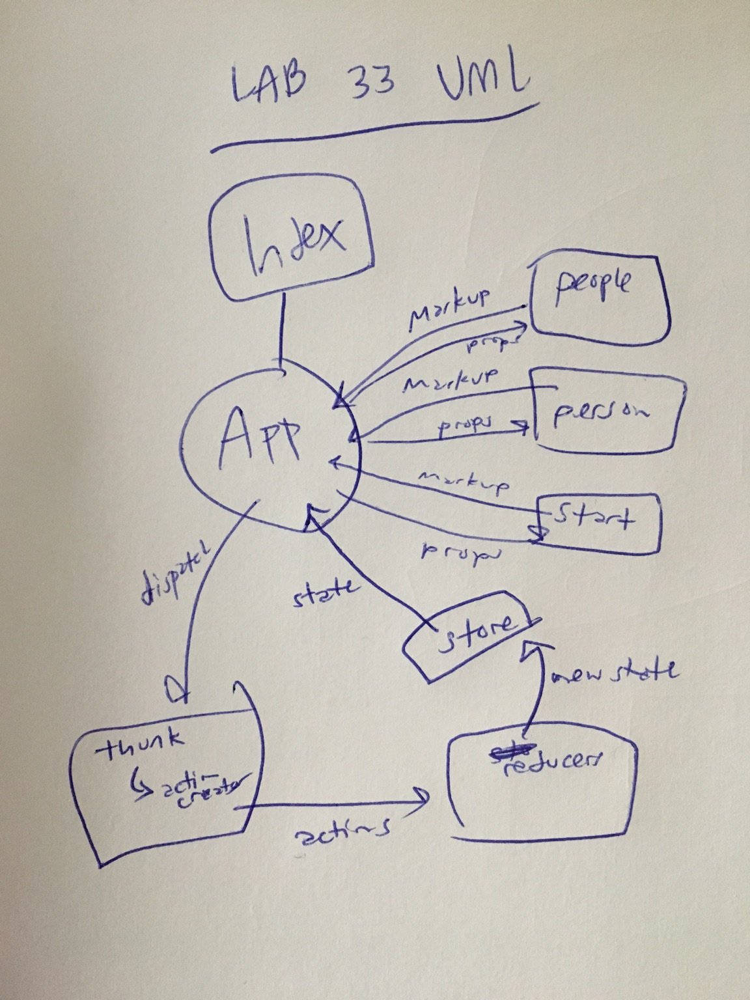

 LAB
=================================================

## Lab 33: Remote APIs

### Author: Joseph Wolfe

### Links and Resources
* [GitHub](https://github.com/charmedsatyr-401-advanced-javascript/lab-33)
* [](https://travis-ci.com/charmedsatyr-401-advanced-javascript/lab-33) 

### Modules
```
.
├── package.json
├── public
│   ├── favicon.ico
│   ├── index.html
│   └── manifest.json
├── README.md
├── src
│   ├── components
│   │   ├── app.js
│   │   ├── app.module.scss
│   │   ├── people.js
│   │   ├── person.js
│   │   └── start.js
│   ├── index.js
│   └── store
│       ├── index.js
│       ├── middleware
│       │   └── reporter.js
│       ├── records-actions.js
│       ├── records-reducer.js
│       └── records-reducer.test.js
└── yarn.lock

5 directories, 17 files
```

### Summary
This application uses thunks to dispatch actions to a Redux store asynchronously. On clicking the button, users will see a list of the results of a superagent `get` from the Star Wars API. On clicking each character, users will see more information about the character from the same API.

#### Tests
* What assertions were made?
  * N/A

* What assertions need to be / should be made?
  * Snapshot and functional tests could be made for each component.
  * Tests could ensure each component properly calls `dispatch` with internal handlers.
  * Action creators and reducers could be further tested to ensure appropriate output.

#### UML

